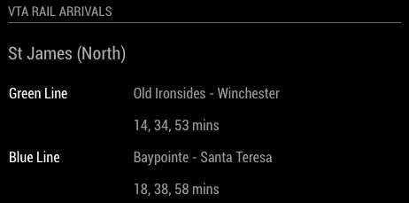

# MMM-VTA-Live


This a module for the [MagicMirror](https://github.com/MichMich/MagicMirror/tree/develop).   This module shows the arrival times for your local stop on the VTA Light Rail system in the Santa Clara, CA area (see below).

## Installation
1. Navigate into your MagicMirror's `modules` folder and execute `git clone https://github.com/nigel-daniels/MMM-VTA-Live`.  A new folder `MMM-VTA-Live` will appear, navigate into it.
2. Execute `npm install` to install the node dependencies.

## Config
Prior to creating the config you will need to locate the `stop_id` of the station you want to monitor. This can be found by running a the following request once you have your own API key.  You can get an API Key from the Mashape marketplace by signing up [here](https://market.mashape.com/transloc/openapi-1-2).  The key you need will be in the example on the left.  For example under curl it is the long value shown as x's in the line `-H 'X-Mashape-Key: xxxxxxxxxxxxxxxxxxxx`
#### Stop ID
Now use the curl request below to get the full list of VTA stops.
```
curl --get --include 'https://transloc-api-1-2.p.mashape.com/stops.json?agencies=255' -H 'X-Mashape-Key: xxxxxxxxxxxxxxxxxxxx' -H 'Accept: application/json'
```
At the time of writing this was the list of valid `stop_id`'s:

|stop_id|Station Name|
|---|---|
|8058664|ALMADEN STATION (0)|
|8205306|ALMADEN STATION (1)|
|8205312|ALUM ROCK STATION (0)|
|8040548|ALUM ROCK STATION (1)|
|8040592|BASCOM STATION (0)|
|8040620|BASCOM STATION (1)|
|8040424|BAYPOINTE STATION (0)|
|8040444|BAYPOINTE STATION (1)|
|8040488|BAYSHORE NASA STATION (0)|
|8040380|BAYSHORE NASA STATION (1)|
|8040532|BERRYESSA STATION (0)|
|8040560|BERRYESSA STATION (1)|
|8040184|BLOSSOM HILL STATION (0)|
|8040348|BLOSSOM HILL STATION (1)|
|8040252|BONAVENTURA STATION (0)|
|8040280|BONAVENTURA STATION (1)|
|8040480|BORREGAS STATION (0)|
|8040388|BORREGAS STATION (1)|
|8040188|BRANHAM STATION (0)|
|8040344|BRANHAM STATION (1)|
|8040600|CAMPBELL STATION (0)|
|8040628|CAMPBELL STATION (1)|
|8040192|CAPITOL STATION (0)|
|8040340|CAPITOL STATION (1)|
|8040448|CHAMPION STATION (0)|
|8040420|CHAMPION STATION (1)|
|8040208|CHILDRENS DISC. MUSEUM STA (0)|
|8040324|CHILDRENS DISCOVERY MUSEUM STA (1)|
|8040428|CISCO STATION (0)|
|8040440|CISCO STATION (1)|
|8040232|CIVIC CENTER STATION (0)|
|8040300|CIVIC CENTER STATION (1)|
|8040248|COMPONENT STATION (0)|
|8040284|COMPONENT STATION (1)|
|8040212|CONVENTION CENTER STATION (0)|
|8040320|CONVENTION CENTER STATION (1)|
|8040176|COTTLE STATION (0)|
|8040356|COTTLE STATION (1)|
|8040524|CROPLEY STATION (0)|
|8040568|CROPLEY STATION (1)|
|8040476|CROSSMAN STATION (0)|
|8040392|CROSSMAN STATION (1)|
|8040196|CURTNER STATION (0)|
|8040336|CURTNER STATION (1)|
|8040580|DIRIDON STATION (0)|
|8040608|DIRIDON STATION (1)|
|821440|EVELYN STATION (0|
|8040472|FAIR OAKS STATION (0)|
|8040396|FAIR OAKS STATION (1)|
|8040588|FRUITDALE STATION (0)|
|8040616|FRUITDALE STATION (1)|
|8040236|GISH STATION (0)|
|8040296|GISH STATION (1)|
|8040456|GREAT AMERICA STATION (0)|
|8040412|GREAT AMERICA STATION (1)|
|8040516|GREAT MALL STATION (0)|
|8040576|GREAT MALL STATION (1)|
|8040596|HAMILTON STATION (0)|
|8040624|HAMILTON STATION (1)|
|8040528|HOSTETTER STATION (0)|
|8040564|HOSTETTER STATION (1)|
|8040432|I-880 STATION (0)|
|8040436|I-880 STATION (1)|
|8040228|JAPANTOWN/AYER STATION (0)|
|8040304|JAPANTOWN/AYER STATION (1)|
|8040244|KARINA COURT STATION (0)|
|8040288|KARINA COURT STATION (1)|
|8040452|LICK MILL STATION (0)|
|8040416|LICK MILL STATION (1)|
|8040484|LOCKHEED MARTIN STATION (0)|
|8040384|LOCKHEED MARTIN STATION (1)|
|8040540|MCKEE STATION (0)|
|8040552|MCKEE STATION (1)|
|8040240|METRO/AIRPORT STATION (0)|
|8040292|METROAIRPORT STATION (1)|
|8040492|MIDDLEFIELD STATION (0)|
|8040376|MIDDLEFIELD STATION (1)|
|8040512|MOFFETT PARK STATION (0)|
|8040508|MOFFETT PARK STATION (1)|
|8040520|MONTAGUE STATION (0)|
|8040572|MONTAGUE STATION (1)|
|8058672|MOUNTAIN VIEW STATION (0)|
|8205310|MOUNTAIN VIEW STATION (1)|
|8040152|OAKRIDGE STATION (0)|
|8040164|OAKRIDGE STATION (1)|
|8040156|OHLONE-CHYNOWETH STATION (0)|
|8040160|OHLONE-CHYNOWETH STATION (1)|
|8040460|OLD IRONSIDES STATION (0)|
|8040408|OLD IRONSIDES STATION (1)|
|8040256|ORCHARD STATION (0)|
|8040276|ORCHARD STATION (1)|
|8040536|PENITENCIA CREEK STATION (0)|
|8040556|PENITENCIA CREEK STATION (1)|
|8040584|RACE STATION (0)|
|8040612|RACE STATION (1)|
|8040464|REAMWOOD STATION (0)|
|8040404|REAMWOOD STATION (1)|
|8040260|RIVER OAKS STATION (0)|
|8040272|RIVER OAKS STATION (1)|
|8040216|SAN ANTONIO STATION (0)|
|8040316|SAN ANTONIO STATION (1)|
|8040636|SAN FERNANDO STATION (0)|
|8040640|SAN FERNANDO STATION (1)|
|8040220|SANTA CLARA STATION (0)|
|8040312|SANTA CLARA STATION (1)|
|8058668|SANTA TERESA STATION (0)|
|8205308|SANTA TERESA STATION (1)|
|8040180|SNELL STATION (0)|
|8040352|SNELL STATION (1)|
|8040224|ST JAMES STATION (0)|
|8040308|ST JAMES STATION (1)|
|8040200|TAMIEN STATION (0)|
|8040332|TAMIEN STATION (1)|
|8040264|TASMAN STATION (0)|
|8040268|TASMAN STATION (1)|
|8040468|VIENNA STATION (0)|
|8040400|VIENNA STATION (1)|
|8040204|VIRGINIA STATION (0)|
|8040328|VIRGINIA STATION (1)|
|8040496|WHISMAN STATION (0)|
|8040372|WHISMAN STATION (1)|
|8040604|WINCHESTER STATION (0)|
|8205314|WINCHESTER STATION (1)|

Note: the stops have two entries as it depends on the direction of travel you want to monitor.

#### Config
The entry in `config.js` can include the following options:

|Option|Description|
|---|---|
|`api_key`|**Required** This is the API key assigned to you on the Mashape marketplace (see above).<br><br>**Type:** `string`<br>|
|`stop_id`|**Required** This the `stop_id` of the station you want to monitor (see above).<br><br>**Type:** `number`|
|'stop_name'|This is the name of the stop you are monitoring.<br><br>**Type:** `string`<br>**Default value:** `???`|
|`interval`|How often the status is updated.<br><br>**Type:** `integer`<br>**Default value:** `60000` // 1 minute|

Here is an example of an entry in `config.js`
```
{
    module:    'MMM-VTA-Live',
    position:  'top_left',
    header:    'VTA Rail Arrivals',
    config:	 {
                api_key:   'xxxxxxxxxxxxxxxxxxxx',
				stop_id:   '8040224',  // ST JAMES STATION (0)
				stop_name: 'St James (North)',
				interval:  60000
                }
},
```

## Dependencies
- [request](https://www.npmjs.com/package/request) (installed via `npm install`)
- [moment](https://www.npmjs.com/package/moment) (installed via `npm install`)

## Notes
Feel free to submit pull requests or post issues and I'll do my best to respond.

## Thanks To...
- [Michael Teeuw](https://github.com/MichMich) for the [MagicMirror2](https://github.com/MichMich/MagicMirror/tree/develop) framework that made this module possible.
- [Transloc Open API](https://market.mashape.com/transloc/openapi-1-2/overview) for the guides and information they publish on their API.
- [Santa Clara Valley Transit Authority](https://www.vta.org) for publishing this useful data.
